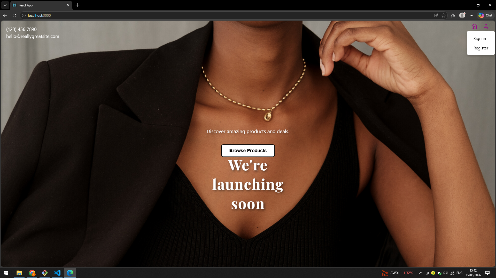
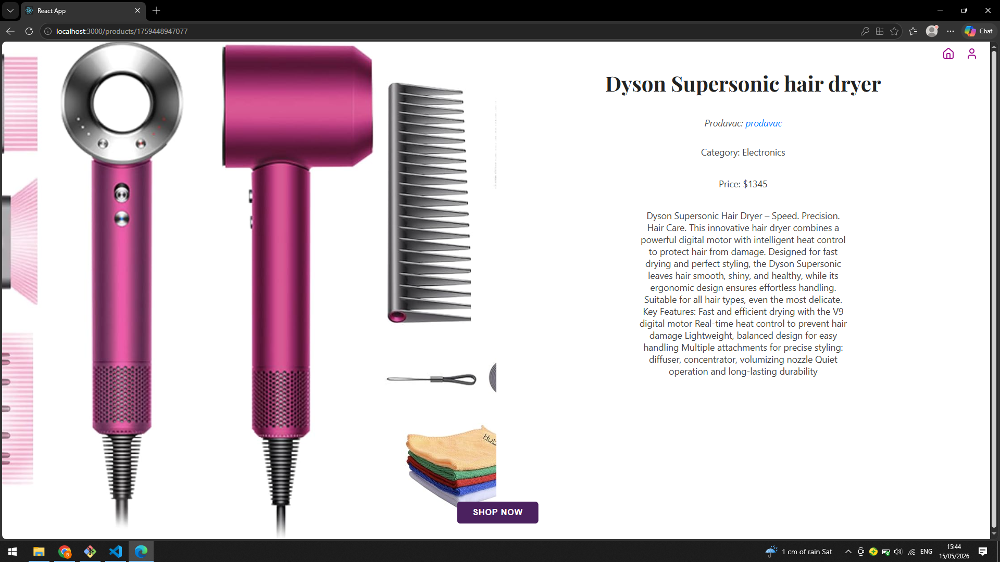
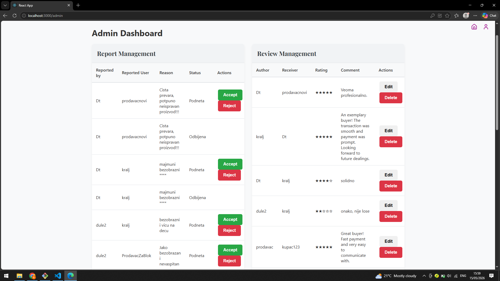
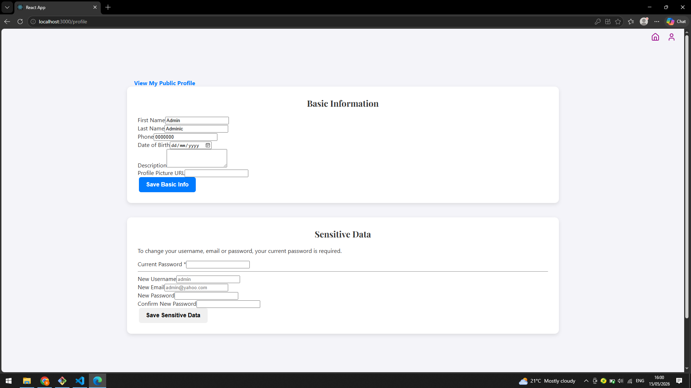

# Platforma za kupovinu i prodaju

Veb aplikacija koja korisnicima omogućava kupovinu i prodaju proizvoda putem fiksne cene ili aukcije, nalik na KupujemProdajem i Limundo.

Projekat je realizovan u okviru kursa **Veb programiranje 2024/25** na Fakultetu tehničkih nauka u Novom Sadu.

**Članovi tima:**
- Bojana Milošević
- Dušan Lazić

---

## Tehnologije

### Frontend
- **React 19** — korisničko sučelje
- **React Router DOM 7** — rutiranje
- **jwt-decode** — dekodovanje JWT tokena na klijentskoj strani
- **lucide-react / react-icons** — ikonice

### Backend
- **Node.js** sa **Express 5** — REST API server
- **jsonwebtoken** — autentifikacija putem JWT tokena
- **bcrypt** — heširanje lozinki
- **cors** — podrška za cross-origin zahteve
- **uuid** — generisanje jedinstvenih ID-eva

### Čuvanje podataka
Podaci se trajno čuvaju u **JSON fajlovima** (bez baze podataka):
- `backend/data/users.json`
- `backend/data/products.json`
- `backend/data/categories.json`
- `backend/data/reviews.json`
- `backend/data/reports.json`
- `backend/data/carts.json`
- `backend/data/cartItems.json`

---

## Struktura projekta

```
student-project/
├── backend/
│   ├── controllers/        # Logika obrade zahteva
│   ├── data/               # JSON fajlovi sa podacima
│   ├── middleware/         # Auth middleware (JWT provera)
│   ├── models/             # Modeli podataka
│   ├── repositories/       # Sloj za rad sa JSON fajlovima
│   ├── routes/             # Definicije API ruta
│   ├── services/           # Poslovna logika
│   ├── index.js            # Ulazna tačka servera
│   └── package.json
└── frontend/
    ├── public/             # Statički fajlovi i slike
    ├── src/
    │   ├── context/        # AuthContext (globalno stanje korisnika)
    │   ├── css/            # Stilovi po stranicama
    │   ├── pages/          # React stranice/komponente
    │   └── services/       # Servisni sloj za API pozive
    └── package.json
```

---

## Pokretanje aplikacije

### Preduslovi
- **Node.js** (preporučena verzija 18+)
- **npm**

### 1. Pokretanje backenda

```bash
cd backend
npm install
node index.js
```

Server se pokreće na: `http://localhost:5000`

### 2. Pokretanje frontenda

```bash
cd frontend
npm install
npm start
```

Aplikacija se otvara na: `http://localhost:3000`

> Frontend je konfigurisan sa proxyjem na `http://localhost:5000`, tako da API pozivi automatski idu na backend.

---

## Funkcionalnosti

### Neprijavljeni korisnik
- Pregled, pretraga i filtriranje proizvoda (po nazivu, opisu, ceni, tipu prodaje, kategoriji, lokaciji)
- Pregled i pretraga kategorija
- Registracija (kao kupac ili prodavac)
- Prijava

### Kupac
- Ažuriranje profila (osnovni podaci, datum rođenja, profilna slika, opis)
- Pregled profila drugih korisnika
- Kupovina proizvoda po fiksnoj ceni
- Učestvovanje u aukcijama (davanje ponuda)
- Otkazivanje kupovine (dok je u statusu "Obrada")
- Ocenjivanje prodavaca (1–5 + komentar)
- Pregled recenzija
- Prijava prodavca administratoru

### Prodavac
- Ažuriranje profila
- Postavljanje proizvoda na prodaju (fiksna cena ili aukcija)
- Dodavanje novih kategorija
- Ažuriranje informacija o proizvodu
- Odobravanje ili odbijanje porudžbina
- Proglašavanje kraja aukcije
- Ocenjivanje kupaca (1–5 + komentar)
- Pregled recenzija
- Prijava kupca administratoru

### Administrator
- Pregled, izmena i brisanje recenzija
- Pregled svih prijava korisnika
- Prihvatanje ili odbijanje prijava (uz razlog odbijanja)
- Blokiranje korisnika (prihvatanjem prijave)

---

## Uloge korisnika

| Uloga | Opis |
|---|---|
| Kupac | Može kupovati proizvode i učestvovati u aukcijama |
| Prodavac | Može postavljati proizvode i upravljati prodajom |
| Administrator | Nadgleda sistem, upravlja prijavama i recenzijama |

> Administratori se učitavaju programski iz baze i ne mogu se registrovati putem aplikacije.

---

## Statusi proizvoda

| Status | Opis |
|---|---|
| Na prodaji | Proizvod je aktivan i dostupan za kupovinu |
| Obrada | Kupovina je inicirana, čeka odobrenje prodavca |
| Prodato | Prodavac je odobrio prodaju |
| Odbijeno | Prodavac je odbio porudžbinu |
| Otkazano | Kupac je otkazao kupovinu |

---

## Screenshots

### Početna stranica


### Lista proizvoda


### Detalji proizvoda


### Admin dashboard


### Profil korisnika


---

## Verzionisanje

Projekat se verzionuje pomoću **Git**-a, a repozitorijum je dostupan na [GitLab](https://gitlab.com).
